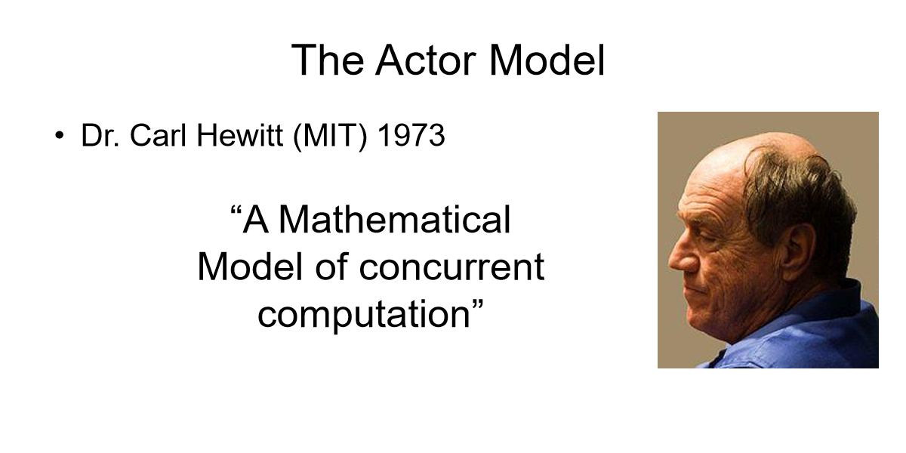
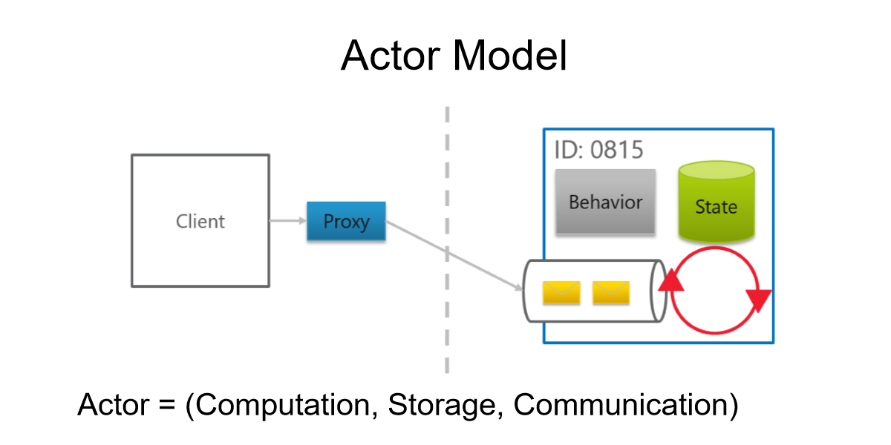
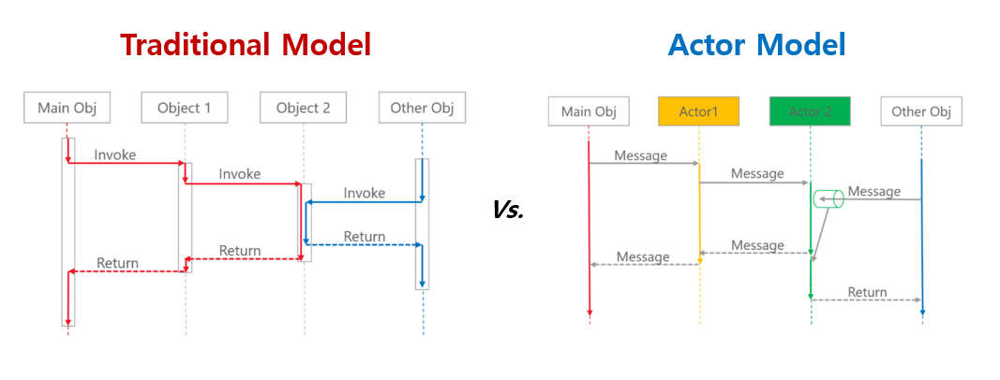
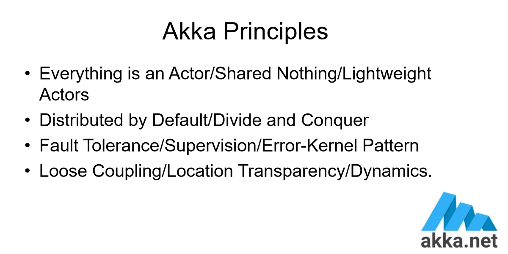
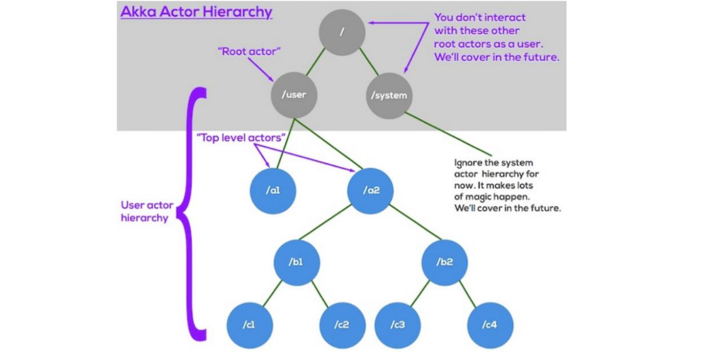

> ### 참고 자료
[**Actor Model 한글 Wiki**](https://ko.wikipedia.org/wiki/%ED%96%89%EC%9C%84%EC%9E%90_%EB%AA%A8%EB%8D%B8)  
[**Actor Model 영문 Wiki**](https://en.wikipedia.org/wiki/Actor_model)  
 
 

> ### Actor Model 주요 개념
   
   
   
   
  

