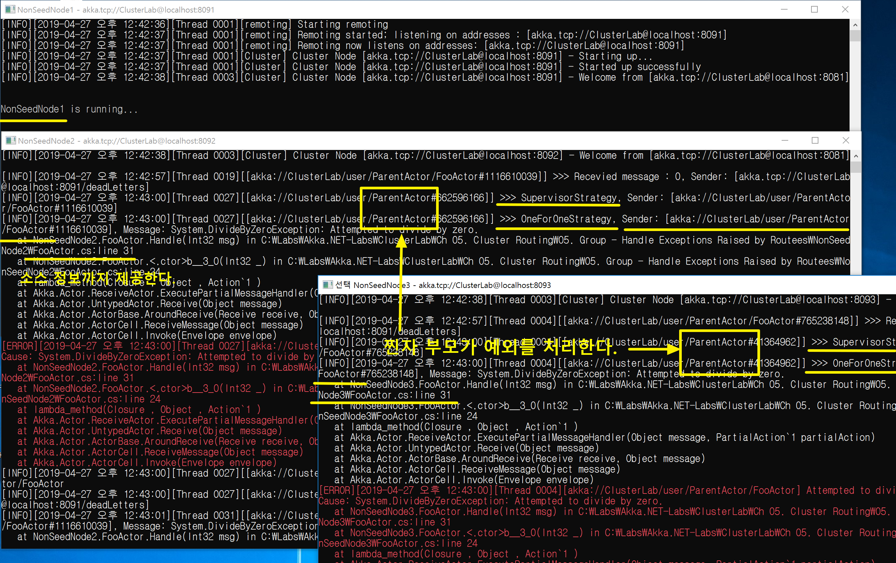

## Cluster Group Routing 예외 처리 데모
1. 데모 액터 구조
   - 기본 액터
      - 8091/user/
      - 8092/user/ParentActor/FooActor
      - 8093/user/ParentActor/FooActor
   - Props.Empty
     - /user/Distributor

2. Router vs. Routee 

| Group Router  | Group Routee  |  
| --- | --- |  
| Distributor | 8092/user/ParentActor/FooActor, 8093/user/ParentActor/FooActor |  

3. allow-local-routees 설정
   - allow-local-routees = off

4. 예외 처리하기
   - Distributor에서 FooActor에게 예외를 발생시키는 메시지(0)를 보낸다.
   - ParentActor가 발생한 예외를 처리한다.
   
