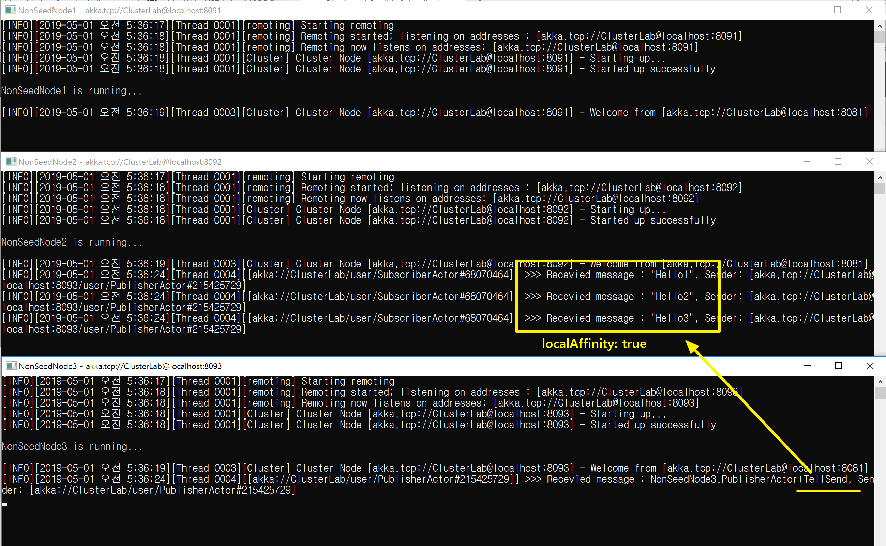

## 액터 경로로 메시지 보내기(Local Affinitiy)
1. localAffinity이용하여, 이전 메시지를 받은 액터에게 다시 메시지를 보낸다.
   ```
   var mediator = DistributedPubSub.Get(Context.System).Mediator;
   mediator.Tell(new Send("/user/SubscriberActor", 
	"Hello1",
	localAffinity: true));
   ```

<br/>
<br/>

## 데모
1. 메시지 3번 모두 `localAffinity: true'로 보낸다.
   ```
   mediator.Tell(new Send("/user/SubscriberActor", 
   	  "Hello1",
   	  localAffinity: true));
   
   mediator.Tell(new Send("/user/SubscriberActor", 
   	  "Hello2",
   	  localAffinity: true));
   
   mediator.Tell(new Send("/user/SubscriberActor",
   	  "Hello3",
   	  localAffinity: true));
   ```
				


2. 메시지 2개만 `localAffinity: true'로 보낸다.
   ```
   mediator.Tell(new Send("/user/SubscriberActor", 
   	  "Hello1",
   	  localAffinity: false));
   
   mediator.Tell(new Send("/user/SubscriberActor", 
   	  "Hello2",
   	  localAffinity: true));
   
   mediator.Tell(new Send("/user/SubscriberActor",
   	  "Hello3",
   	  localAffinity: true));
   ```

