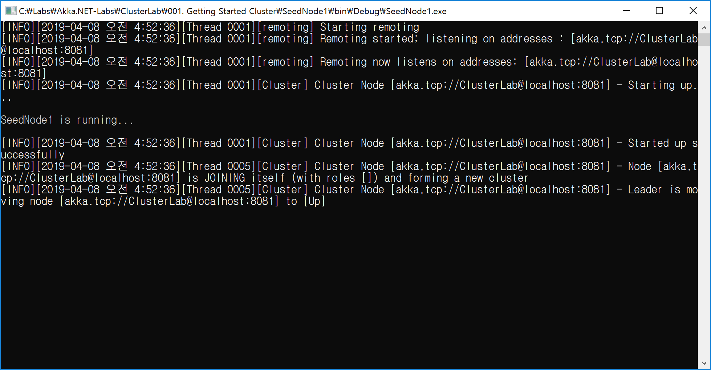

## 클러스터 구성하기(필수 조건)

- **클러스터를 구성하기 위한 모든 ActorSystem은 반드시 이름이 같아야 한다.**
```cs
ActorSystem.Create("ClusterLab", ...);
```

<br/>

- **클러스터 시작점(Seed Node) 정보를 모두 공유한다.**
```
	cluster {
		seed-nodes = [
			"akka.tcp://ClusterLab@localhost:8081"
		]
	}
```
<br/>
<br/>

## 데모 시나리오
- 포트 정보
  - SeedNode1 : 8081
  - NonSeedNode1 : 8091
  - NonSeedNode2 : 8092
  - NonSeedNode3 : 8093
  
- 실행 순서
  - SeedNode1 실행
  - NonSeedNode1 실행
  - NonSeedNode2 실행
  - NonSeedNode3 실행

- 실행 예.
  - SeedNode1(8081)만 실행할 때


  - SeedNode1(8081) 실행 후 NonSeedNode1(8091)가 실행될 때

