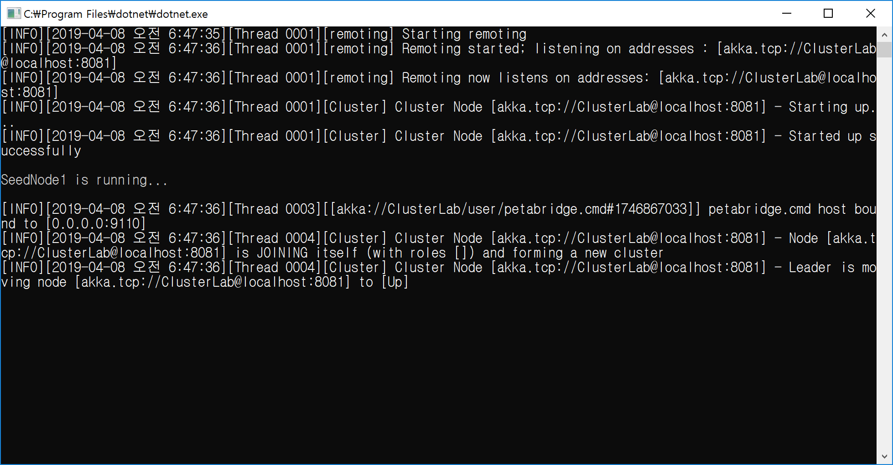
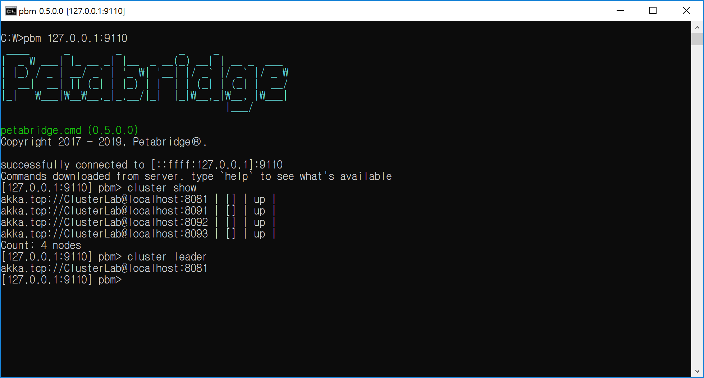

## Petabridge.Cmd 설치하기
1. Chocolatey을 설치한다(https://chocolatey.org/install)
   - 관리자 콘솔 모드에서 설치 명령어를 실행 시킨다.
  

2. Petabridge.Cmd을 설치한다(한번만 수행).  
   - 관리자 콘솔 모드에서 설치 명령어를 실행 시킨다.
```
	choco install petabridge-cmd
```
  
  
<br/>

## Petabridge.Cmd 통합하기

1. SeedNode에 Petabridge.Cmd.Cluster NuGet을 설치한다.

2. App.Akka.hocon 파일에 Petabridge.Cmd 환경을 설정한다.
   - 9110 포트를 기본으로 사용한다.
```
        ##################################
        # petabridge.cmd Reference Config File #
        ##################################
        petabridge.cmd {
	        # default IP address used to listen for incoming petabridge.cmd client connections
	        # should be a safe default as it listens on "all network interfaces".
	        host = "0.0.0.0"

	        # default port number used to listen for incoming petabridge.cmd client connections
	        port = 9110

	        # when true, logs all loaded palettes on startup
	        log-palettes-on-startup = on
        }
```

3. Seed Node에 Petabridge.Cmd 구현하기
```
using Petabridge.Cmd.Cluster;
using Petabridge.Cmd.Host;

	var cmd = PetabridgeCmd.Get(system);
	cmd.RegisterCommandPalette(ClusterCommands.Instance);
	cmd.Start();
```

<br/>

## Petabridge.Cmd 이해하기
1. Petabridge.Cmd 사용하기
    - **접속 : pbm 127.0.0.1:9091**
    - **상태 : cluster show**
    - **상황 : cluster status**
    - **리더 : cluster leader**
    - **계층 : actor hierarchy** // "-d 4"가 기본 값이다.
	- **계층 : actor hierarchy -d 8**
	
2. 접속하기
```
C:\> pbm 127.0.0.1:9091
```

3. 액터 계층구조 보기
```
[127.0.0.1:9110] pbm> actor hierarchy -d 8
/user
/user/pbm-uptime
/user/petabridge.cmd
/user/petabridge.cmd/127.0.0.1%3A56193
/user/petabridge.cmd/127.0.0.1%3A56193/actor
/user/petabridge.cmd/127.0.0.1%3A56193/actor/handler
/user/petabridge.cmd/127.0.0.1%3A56193/actor/handler/$b
/user/petabridge.cmd/127.0.0.1%3A56193/cluster
/user/petabridge.cmd/127.0.0.1%3A56193/cluster/cluster
/user/petabridge.cmd-log-memorizer
```

4. 클러스터 상황(status) 확인하기
```
[127.0.0.1:9110] pbm> cluster status
akka.tcp://ClusterApp@localhost:8081 | [] | up |
```

5. 클러스터 리더 확인하기
```
[127.0.0.1:9110] pbm> cluster leader
akka.tcp://ClusterApp@localhost:8081
```

6. 클래스터 상태(state) 확인하기
```
	[127.0.0.1:9110] pbm> cluster show
	akka.tcp://ClusterApp@localhost:8081 | [] | up |
	akka.tcp://ClusterApp@localhost:8091 | [] | up |
	akka.tcp://ClusterApp@localhost:8092 | [] | up |
	Count: 3 nodes

	// 8092 클러스터 이탈
	//
	[127.0.0.1:9110] pbm> cluster show
	akka.tcp://ClusterApp@localhost:8081 | [] | up |
	akka.tcp://ClusterApp@localhost:8091 | [] | up |
	akka.tcp://ClusterApp@localhost:8092 | [] | up | unreachable
	Count: 3 nodes

	// 8092 클러스터 조인 중
	//
	[127.0.0.1:9110] pbm> cluster show
	akka.tcp://ClusterApp@localhost:8081 | [] | up |
	akka.tcp://ClusterApp@localhost:8091 | [] | up |
	akka.tcp://ClusterApp@localhost:8092 | [] | joining |
	Count: 3 nodes

	// 8092 클러스터 조인 완료
	//
	[127.0.0.1:9110] pbm> cluster show
	akka.tcp://ClusterApp@localhost:8081 | [] | up |
	akka.tcp://ClusterApp@localhost:8091 | [] | up |
	akka.tcp://ClusterApp@localhost:8092 | [] | up |
	Count: 3 nodes
```	
<br/>

## 데모 시나리오
- 포트 정보
  - SeedNode1 : 8081
  - NonSeedNode1 : 8091
  - NonSeedNode2 : 8092
  - NonSeedNode3 : 8093
 
- 실행 예.
  - SeedNode1 실행
  
  - Petabridge.Cmd로 SeedNode1에 접속하기
  
  - Cluster 상태 확인하기
  
 
## TODO
- [ ] host 설정 이해하기
```
	# host = "localhost"
	# Really not a good idea to use DNS for binding inbound endpoints, 
	# but we'll try anyway. Resolving localhost
```