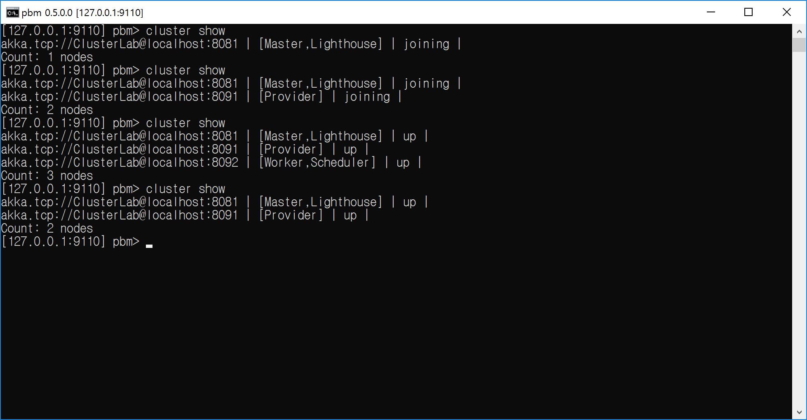

## Cluster을 구성하기 위한 최소 Node 개수 지정하기.
1. 최소 Cluster의 Node 개수는 1이다.
  - Seed Node까지 포함해서 카운트 한다.
  - 최소 Node 개수를 만족하기 전까지는 "Joining" 상태가 된다.
  - 클러스터가 구성된 이후에는 무시한다.  
```
		# Minimum required number of members before the leader changes member status
		# of 'Joining' members to 'Up'. Typically used together with
		# 'Cluster.registerOnMemberUp' to defer some action, such as starting actors,
		# until the cluster has reached a certain size.
		min-nr-of-members = 1
```
 
<br/>
<br/>

## 데모 시나리오
- "**min-nr-of-members = 3**" 일 때
  - Seed Node까지 포함하여 최소 Node 개수를 카운드 한다.
  - 최소 Node 개수를 3을 만족하기 전까지는 "Joining" 상태가 된다.
  - 클러스터가 구성된 이후 최소 개수는 무시된다.
  
