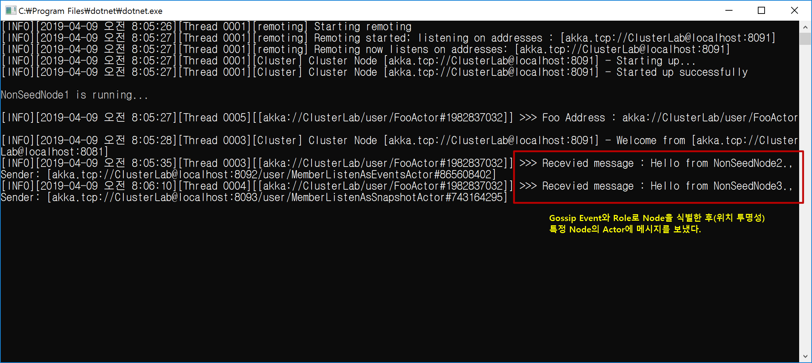
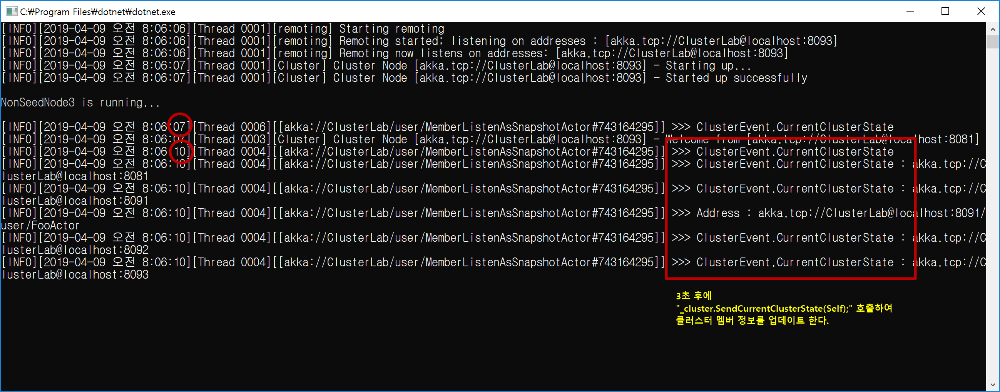

## Gossip 이벤트를 이용한 클러스터 멤버 상태 확인하기

1. 개요
```cs
using Akka.Cluster;

Cluster _cluster = Cluster.Get(Context.System);

// Gossip 이벤트 등록하기
_cluster.Subscribe(Self,
	ClusterEvent.SubscriptionInitialStateMode.InitialStateAsEvents,
	new[] { typeof(ClusterEvent.MemberUp) });

// Gossip 이벤트 등록 해지하기	
_cluster.Unsubscribe(Self);

// Gossip 이벤트 처리하기
Receive<ClusterEvent.MemberUp>(_ => Handle(_));
```

2. Event vs. Snapshot, Event : Gossip 정보를 연속으로 받는다(변경이 있을 때마다 자동으로).
```cs
_cluster.Subscribe(Self,
                ClusterEvent.SubscriptionInitialStateMode.InitialStateAsEvents,
                new[] { typeof(ClusterEvent.MemberUp) });

Receive<ClusterEvent.MemberUp>(_ => Handle(_));
```

3. Event vs. Snapshot, Snapshot : 현재 Gossip 상태를 받는다.				
```cs
_cluster.Subscribe(Self, 
                ClusterEvent.SubscriptionInitialStateMode.InitialStateAsSnapshot, 
                new[] { typeof(ClusterEvent.MemberUp) });
				
Receive<ClusterEvent.CurrentClusterState>(_ => Handle(_));
```

4. 자신이 [Up]될 때(클러스터에 합류할 때) 호출되는 Callback 함수
```cs
_cluster.RegisterOnMemberUp(() =>
	{
		//
		// 자신이 클러스터에 합류할 때([Up]될 때) 호출된다.
		//
	});
```

<br/>
<br/>

## 데모 시나리오
- Gossip과 Role을 통해 Node을 식별한다.
   - member.Status == MemberStatus.Up
   - member.HasRole("Provider")
- 식별될 Node로 부터 액터에게 메시지를 보낸다(위치 투명성).
   - **Context.ActorSelection(member.Address + $"/user/FooActor").Tell( ... );**
   - NonSeedNode2, 3에서 string 메시지를 보낸다(IP와 Port 정보를 알지 못한다, 단 Role과 /user/... 정보를 알고 있다).
   - NonSeedNode1에서 string 타입 메시지를 받는다.
- NonSeedNode1 메시지 받기

- NonSeedNode2 메시지 보내기, Event로 Gossip 처리하기

- NonSeedNode3 메시지 보내기, Snapshot(3초 후)로 Gossip 처리하기

   
   
   
 
