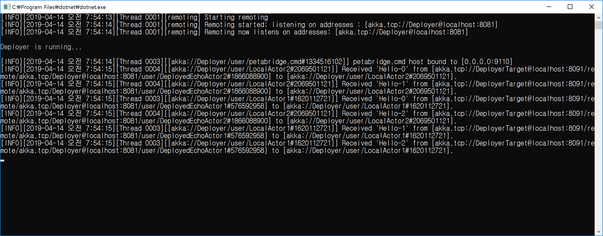

## 다른 액터 시스템에 액터 배포하기
1. 환경 설정으로 액터 배포하기
```
actor {
	provider = remote
	deployment {
		/DeployedEchoActor1 {
			remote = "akka.tcp://DeployerTarget@localhost:8091"
		}
	}
}

// 명시적으로 배포 관련 함수를 호출하지 않는다.
var remoteEcho1 = system.ActorOf(
	DeployedEchoActor
		.Props(), 
	"DeployedEchoActor1");
```

2. 코드로 액터 배포하기
```
var remoteEcho2 = system.ActorOf(
	DeployedEchoActor
		.Props()
		.WithDeploy(Deploy.None.WithScope(new RemoteScope(Address.Parse("akka.tcp://DeployerTarget@localhost:8091")))),
	"DeployedEchoActor2");
```

3. 배포된 액터 계층 구조
   - 액터를 배포하는 곳: /user 밑에 생성한다.
     - akka://Deployer/user/**DeployedEchoActor1**
   - 액터가 배포되는 곳: /remote/"배포한 액서 시스템 Actor Path"
     - akka://DeployerTarget/remote/akka.tcp/Deployer@localhost:57737/user/**DeployedEchoActor1**
  
4. **만약 원격에 배포할 수 없게되면 Wraning 로그를 출력한다.**

<br/>
<br/>

## 데모 시나리오
1. 구성
   - Deployer: 배포하는 곳(LocalActor)
     
   - DeployerTarget: 배포되는 곳
     
   - DeployerShared: 배포하는 액터(DeployedEchoActor)

1. 액터 Run-time 구조
   - Deployer
     - akka://Deployer/user/DeployedEchoActor1
     - akka://Deployer/user/DeployedEchoActor2
     - akka://Deployer/user/Local1
     - akka://Deployer/user/Local2
   - DeployerTarget
     - akka://DeployerTarget/remote/akka.tcp/Deployer@localhost:57737/user/DeployedEchoActor1
     - akka://DeployerTarget/remote/akka.tcp/Deployer@localhost:57737/user/DeployedEchoActor2

1. 배포할 액터는 배포하는 곳/배포되는 곳 모두 참조하고 있어야 한다.
   - Akka.Actor.ActorInitializationException 예외가 발생한다.
   
1. 배포되는 액터 시스템 프로세스를 실행시키지 않은 상태에서 액터를 배포할 때
   - Warnning: AssociationError
   - Wranning: Tried to associate with unreachable remote address  
   
   
<br/>
<br/>

## TODO 
1. Petabridge.Cmd로 배포된 액터를 확인할 수 없다. 
   - actor hierarchy command can't print out remotely deployed actors #26
   - https://github.com/petabridge/petabridge.cmd-issues/issues/26
```
actor system
   akka.tcp://DeployTarget@localhost:8090
actor hierarchy -d 9		// 기본 값은 4이다.
actor hierarchy -s akka.tcp://DeployTarget@localhost:8090 -d 9
```

2. Remote일 때 로그 수준이 "Debug"이면 'Heartbeat' 처리 과정이 반복적으로 출력된다.
   - 어떻게 로그에서 제거할 수 있을까?
```
[DEBUG][ ... ] Sending Heartbeat to [akka.tcp://Deployer@localhost:56367]
[DEBUG][ ... ] Received heartbeat rsp from [akka.tcp://Deployer@localhost:56367]

remote {
	log-remote-lifecycle-events = off	<- 적용이 안된다.
	log-received-messages = off		<- 적용이 안된다.
}
