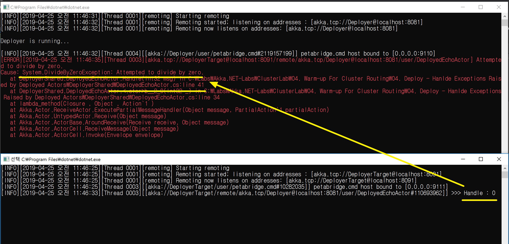

## 다른 액터 시스템에 액터 배포하기
1. 배포된 액터에서 예외가 발생하면 배포한 액터에게 전달된다.
2. 예외가 발생한 소스 라인 정보까지 제공한다.
```
[ERROR]
[2019-04-25 오전 11:46:35]
[Thread 0003]
[akka.tcp://DeployerTarget@localhost:8091/remote/akka.tcp/Deployer@localhost:8081/user/DeployedEchoActor] Attempted to divide by zero.
Cause: System.DivideByZeroException: Attempted to divide by zero.
   at DeployerShared.DeployedEchoActor.Handle(Int32 msg) in C:\Labs\Akka.NET-Labs\ClusterLab\04. Warm-up For Cluster Routing\04. Deploy - Hanlde Exceptions Raised by Deployed Actors\DeployerShared\DeployedEchoActor.cs:line 41
   at DeployerShared.DeployedEchoActor.<.ctor>b__2_0(Int32 _) in C:\Labs\Akka.NET-Labs\ClusterLab\04. Warm-up For Cluster Routing\04. Deploy - Hanlde Exceptions Raised by Deployed Actors\DeployerShared\DeployedEchoActor.cs:line 34
   at lambda_method(Closure, Object, Action`1)
   at Akka.Actor.ReceiveActor.ExecutePartialMessageHandler(Object message, PartialAction`1 partialAction)
   at Akka.Actor.UntypedActor.Receive(Object message)
   at Akka.Actor.ActorBase.AroundReceive(Receive receive, Object message)
   at Akka.Actor.ActorCell.ReceiveMessage(Object message)
   at Akka.Actor.ActorCell.Invoke(Envelope envelope)
```

