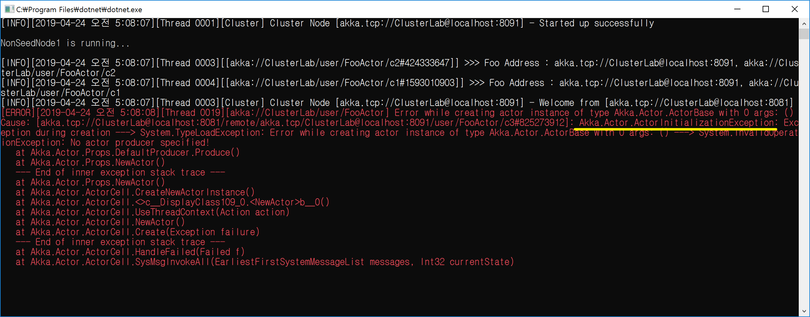

## Cluster Pool Routing 하기
1. Cluster Pool Routing 설정
   - akka.actor.deployment.<actor-path>.cluster.enabled
   - akka.actor.deployment.<actor-path>.cluster.allow-local-routess
   - akka.actor.deployment.<actor-path>.cluster.use-role
   - akka.actor.deployment.<actor-path>.cluster.max-nr-of-instances-per-node
   - akka.actor.deployment.<actor-path>.cluster.max-total-nr-of-instances
```
akka {
	actor {
		provider = "cluster"

		deployment {
			/FooActor {
				router = round-robin-pool
				nr-of-instances = 10

				cluster {
					#
					# Cluster Router을 활성화한다.
					#
					enabled = on

					#
					# allow-local-routess = on		// 자신도 포함한다.
					# allow-local-routess = off		// 자신은 제외한다.
					#
					allow-local-routess = off
					
					#
					# use-role 생략					// Seed 노드를 포함한 모든 노드에 배포한다.
					#	use-role = off					// "off"을 Role 이름으로 인식한다.
					# use-role = Provider				// 특정 노드(Provider)에만 배포한다.
					#
					use-role = Provider
					
					#
					# 노드 단위로 최대 배포할 Routee 개수를 지정한다.
					#
					max-nr-of-instances-per-node = 3
				}
			}
		}
	}
}
```

2. 환경 설정 설명
```
# enable cluster aware router that deploys to nodes in the cluster
enabled = off

# Maximum number of routees that will be deployed on each cluster
# member node.
# Note that max-total-nr-of-instances defines total number of routees, but
# number of routees per node will not be exceeded, i.e. if you
# define max-total-nr-of-instances = 50 and max-nr-of-instances-per-node = 2
# it will deploy 2 routees per new member in the cluster, up to
# 25 members.
max-nr-of-instances-per-node = 1

# Maximum number of routees that will be deployed, in total
# on all nodes. See also description of max-nr-of-instances-per-node.
# For backwards compatibility reasons, nr-of-instances
# has the same purpose as max-total-nr-of-instances for cluster
# aware routers and nr-of-instances (if defined by user) takes
# precedence over max-total-nr-of-instances. 
max-total-nr-of-instances = 10000

# Defines if routees are allowed to be located on the same node as
# the head router actor, or only on remote nodes.
# Useful for master-worker scenario where all routees are remote.
allow-local-routees = on

# Use members with specified role, or all members if undefined or empty.
use-role = ""
```

3. 배포할 액터는 참고되어야 한다.
   - 배포할려는 곳에서 Akka.Actor.ActorInitializationException이 발생한다.  
    Akka.Actor.ActorInitializationException 예외가 발생한다.  
	Akka.Actor.ActorInitializationException 예외가 발생되는 이유는 배포할 Actor 참조가 되어 있지 않기 때문이다.  
	참조를 확인한다.  
```
[ERROR][ ... ] Error while creating actor instance of type Akka.Actor.ActorBase with 0 args: ()
Cause: [ ... ]: Akka.Actor.ActorInitializationException, Akka: Exception during creation ---> System.TypeLoadException: Error while creating actor instance of type Akka.Actor.ActorBase with 0 args: () ---> System.InvalidOperationException: No actor producer specified!
   위치: Akka.Actor.Props.DefaultProducer.Produce()
   위치: Akka.Actor.Props.NewActor()
   --- 내부 예외 스택 추적의 끝 ---
   위치: Akka.Actor.Props.NewActor()
   위치: Akka.Actor.ActorCell.CreateNewActorInstance()
   위치: Akka.Actor.ActorCell.<>c__DisplayClass109_0.<NewActor>b__0()
   위치: Akka.Actor.ActorCell.UseThreadContext(Action action)
   위치: Akka.Actor.ActorCell.NewActor()
   위치: Akka.Actor.ActorCell.Create(Exception failure)
   --- 내부 예외 스택 추적의 끝 ---
   위치: Akka.Actor.ActorCell.HandleFailed(Failed f)
   위치: Akka.Actor.ActorCell.SysMsgInvokeAll(EarliestFirstSystemMessageList messages, Int32 currentState)
```


4. Cluster Routing Pool은 Local과 Deploy 기반으로 동작한다.
   - Local일 때: 자식으로 $a, $b, ... 생성한다.
   - Cluster일 때: 자식 또는 다른 노드의 자식으로 c1, c2, ... 생성한다.
	  - 배포하는 노드 Routee일 때: [akka://ClusterApp/user/ParentActor/JobActor/c1#894639472]
	  - 배포되는 노드 Routee일 때: [akka://ClusterApp/remote/akka.tcp/ClusterApp@localhost:8091/user/ParentActor/JobActor/c3#1889897369]

5. nr-of-instances는 Local일 때와 다르게 동작한다.
   - Local일 때: 명시적으로 N개를 바로 생성한다.
   - Cluster일 때: 설정에 근거하여 생성한다(최대 N개를 생성할 조건이 아니면 전체를 생성하지 않는다).

6. max-total-nr-of-instances 하위 호환성을 위해 존재하는 설정이다(For backwards compatibility reasons)
   - max-total-nr-of-instances는 하위 호환성을 위해서 존재한다.
   - max-total-nr-of-instances가 설정되어 있어도 nr-of-instances 값을 사용하게 된다.

7. 자신도 포함하여 배포할지 지정한다.
   - allow-local-routees = on   // 자신도 포함한다.  
     [akka://ClusterApp/user/ParentActor/JobActor/c1#894639472]
   - allow-local-routees = off	// 자신은 제외한다.  
     [akka://ClusterApp/remote/akka.tcp/ClusterApp@localhost:8091/user/ParentActor/JobActor/c3#1889897369]

8. Role 단위로 배포를 지정한다.
   - use-role 생략					// Seed 노드를 포함한 모든 노드에 배포한다.
   - use-role = worker			// worker Role 노드에게만 배포한다.

9. 노드 단위로 배포할 최대 개수를 지정한다.
   - max-nr-of-instances-per-node 생략		// 노드 단위로 1개가 배포된다.
   - max-nr-of-instances-per-node = 2		// 노드 단위로 최대 2개가 배포된다.

10. 예.
   - 자신을 제외한 Seed을 포함한 모든 노드에 총 10개를 배포한다.
```
    deployment {
        /ParentActor/JobActor {
			router = round-robin-pool 
			nr-of-instances = 10 
			cluster {
				enabled = on
				allow-local-routees = off         
			}
        }
    }
```

   - 자신을 제외한 Seed을 포함한 모든 노드 당 최대 2개씩 총 10개를 배포한다.
```
	deployment {
        /ParentActor/JobActor {
			router = round-robin-pool 
			nr-of-instances = 10 
			cluster {
				enabled = on
				allow-local-routees = off         
				max-nr-of-instances-per-node = 2
			}
        }
    }
```

   - 자신을 제외한 worker Role 노드 당 최대 2개씩 총 10개를 배포한다.
```
    deployment {
        /ParentActor/JobActor {
			router = round-robin-pool 
			nr-of-instances = 10 
			cluster {
				enabled = on
				allow-local-routees = off         
				use-role = worker
				max-nr-of-instances-per-node = 2
			}
        }
    }
```

<br/>
<br/>

## 데모
1. .NET Framework(정상 동작) vs. .NET Core(버그)

2. Provider 노드만 Routing 한다.
   - akka.actor.deployment./FooActor.cluster.enabled = on
   - akka.actor.deployment./FooActor.cluster.allow-local-routess = on
   - akka.actor.deployment./FooActor.cluster.use-role = Provider
   - akka.actor.deployment./FooActor.cluster.max-nr-of-instances-per-node = 2
   


<br/>
<br/>

## TODO
1. user-role 복수개는 지정할 수 없나?
1. WithRouter로 설정으로 cluster 설정하는 방법은?
1. 'Router -> Routee, Router -> Routee' 관계를 WithRouter로 만들기

