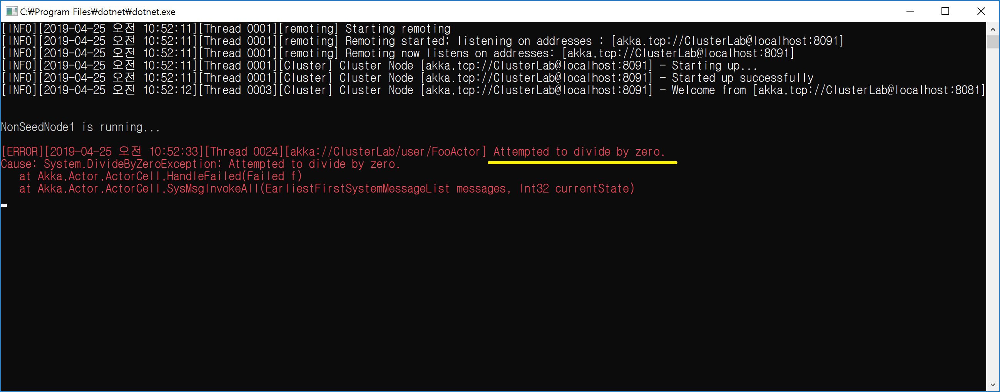

## Cluster Pool Routing 예외 정보가 부족하다
1. Cluster Pool Routing일 때 예외가 발생된 소스 라인 정보가 전달되지 않는다.
   - NonSeedNode1에서 FooActor를 NonSeedNode2에게 배포한다.
   - NonSeedNode1 환경 설정
```
akka {
	actor {
		provider = "cluster"

		deployment {
			/FooActor {
				router = round-robin-pool
				nr-of-instances = 10

				cluster {
					enabled = on
					allow-local-routess = off
					max-nr-of-instances-per-node = 3
					
					#
					# Scheduler Role에게 Cluster Routee를 배포한다.
					#
					use-role = Scheduler
				}
			}
		}
	}
	...
}
```
   - NonSeedNode2 환경 설정
```
akka {
	actor {
		provider = "cluster"
	}

    ...

	cluster {
		...

		roles = [
			"Scheduler"
		]
	}
}
```




<br/>
<br/>

## TODO
1. Akka.NET 팀에게 해당 이슈를 제기한다.
