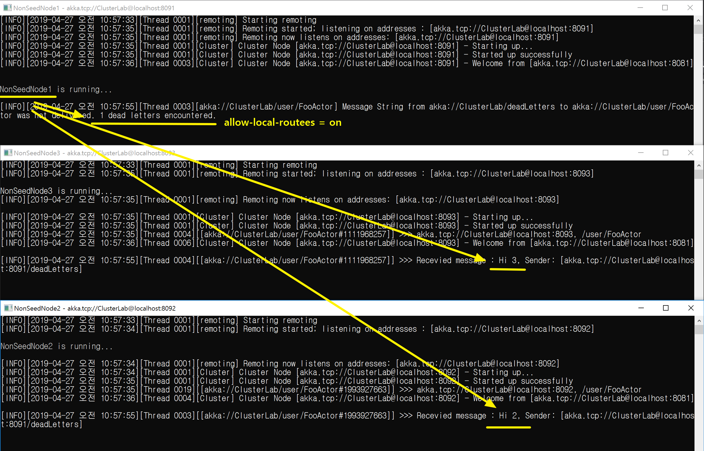

## 생성된 액터로 클러스터 라우팅하기
1. 생성된 액터 경로를 명시한다.
   - akka.actor.deployment.<액터경로>.routees.paths = [ ... ]
   - **"/user/FooActor"에 있는 모든 액터가 Routee가 된다.**
```
akka {
	actor {
		provider = "cluster"

		deployment {
			/Distributor {
				router = round-robin-group
				routees.paths = [
					"/user/FooActor"
				]
		
				cluster {
					enabled = on

					#
					# Provider 역할자만 대상으로 Routee 한다.
					#
					allow-local-routees = off
					use-role = Provider
				}
			}
		}
	}

	...
}
```

2. Group Router 액터를 생성한다.
   - Props.Empty.WithRouter(FromConfig.Instance)
```
var roundRobinGroupActor = system.ActorOf(Props.Empty
		.WithRouter(FromConfig.Instance),
		"Distributor");
```

<br/>
<br/>

## 데모
1. 데모 액터 구조
   - 기본 액터
      - 8091/user/
      - 8092/user/FooActor
      - 8093/user/FooActor
   - Props.Empty
     - /user/Distributor

2. Router vs. Routee 

| Group Router  | Group Routee  |  
| --- | --- |  
| Distributor | 8092/user/FooActor, 8093/user/FooActor |  

3. allow-local-routees 설정
   - allow-local-routees = off
   

   - allow-local-routees = on
   
   
   
<br/>
<br/>

## TODO?
1. ActorPath가 모두 일치해야 한다?
   - routees.paths = [ "/user/FooActor" ]
   - routees.paths = [ "/user/FooActor1", "/user/FooActor2" ]    <-- 동작하지 않는다.  
     다른 노드에 있는 /user/FooActor2에게 메시지가 전송되지 않는다(DeadLetter).

2. Group Router 생성 후(20초) 메시지를 전송해야 한다?
   - Routing되기 전에 바로 메일을 전송하면 전달되지 않는다
      - Dead Letter에게도 전달되지 않는다.
	  - Sleep 전에(다른 노드 접속 인식 전에) Router을 생성해야 한다.
