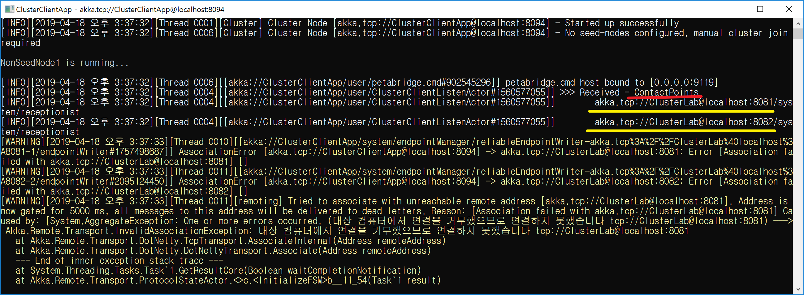
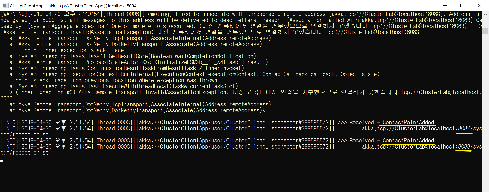
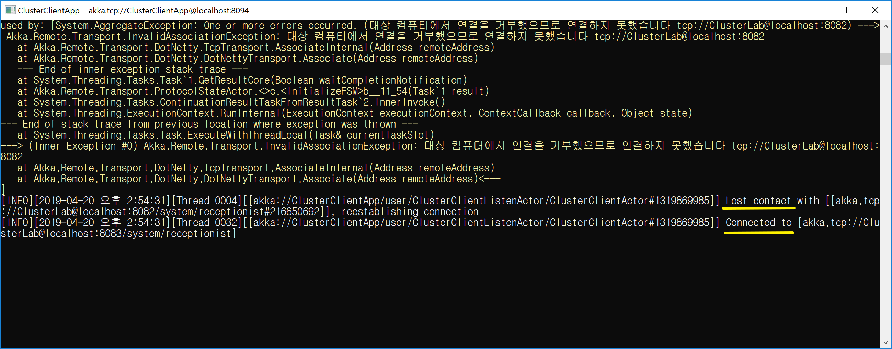
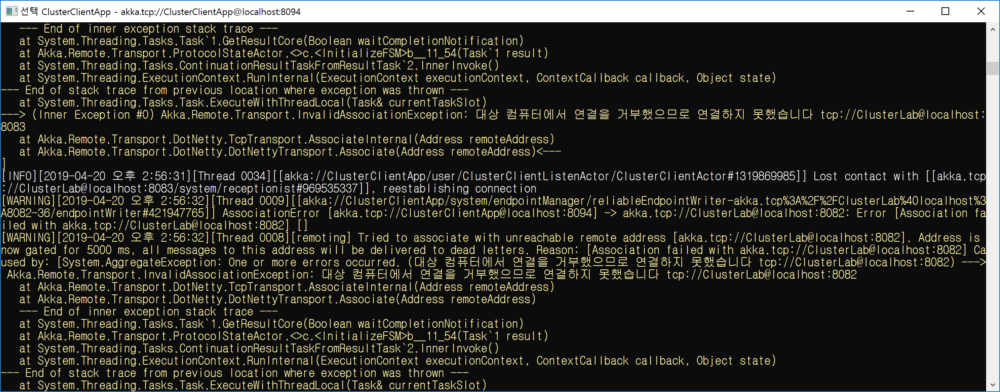

## 이벤트 Subscribe하기
1. 주요 기능 정리
   - ClusterClient 액터를 생성한다: ClusterClient.Props(ClusterClientSettings.Create(Context.System))
   - ClusterClient 액터에게 이벤트를 등록한다: _clusterClientActor.Tell(SubscribeContactPoints.Instance);
```
_clusterClientActor = Context.ActorOf(
	ClusterClient
		.Props(ClusterClientSettings.Create(Context.System)),
	"ClusterClientActor");

//
// 이벤트 등록: SubscribeContactPoints.Instance 
//      -> Receive<ContactPoints>
//      -> Receive<ContactPointAdded>
//      -> Receive<ContactPointRemoved>
// 이벤트 제거: UnsubscribeContactPoints.Instance
//
//   vs.
//
// 명시적 확인: GetContactPoints.Instance 
//      -> Receive<ContactPoints>
//
_clusterClientActor.Tell(SubscribeContactPoints.Instance);
```
## 데모 1 - Seed Node가 2개일 때
1. 데모 시나리오
   - ClusterClientApp 실행: ContactPoints
   - SeedNode1 실행( 1개가 접속 가능할 때): ContactPointAdded(N개), ContactPointRemoved(N - 1개)
   - SeedNode2 실행
   - SeedNode1 종료: ContactPointAdded(1개), ContactPointRemoved(1개)
2. 메시지 정의
   - ContactPoints: 접속 대상 목록
   - ContactPointAdded: 접속 시도
   - ContactPointRemoved: 접속 시도 실패, 접속 해제
3. 데모 요약
   - ClusterClient가 실행되면 ContactPoints 받는다.
   - ContactPoints 정보 중에 접속 가능하면 전체를 대상(ContactPointAdded N번 호출)으로 접속 시도를 한다.
   - 접속 중일 때는 새 접속 가능한 대상이 추가되어도 ContactPointAdded는 호출되지 않는다.
   - 접속 중인 노드가 종료되면 새 접속 대상으로 접속을 시도한다. 
4. 데모 시나리오 
   - ClusterClientApp 실행
      - ContactPoints
         - akka.tcp://ClusterLab@localhost:8081
         - akka.tcp://ClusterLab@localhost:8082
   
   
   - SeedNode1 실행
      - ContactPointAdded
         - akka.tcp://ClusterLab@localhost:8081
         - akka.tcp://ClusterLab@localhost:8082   
   
   
      - ContactPointRemoved
         - akka.tcp://ClusterLab@localhost:8082   
   
   
   - SeedNode2 실행
   
   - SeedNode1 종료
      - ContactPointAdded
         - akka.tcp://ClusterLab@localhost:8082   
      - ContactPointRemoved
         - akka.tcp://ClusterLab@localhost:8081
   
   
   
<br/>
<br/>

## 데모 2 - Seed Node가 3개일 때
1. 데모 시나리오
   - ClusterClientApp을 실행한다. 
   
   - SeedNode1을 실행한다.
   
   - SeedNode2을 실행한다.
   - SeedNode3을 실행한다.
   
   - SeedNode1을 종료 시킨다.
   
   - SeedNode2을 종료 시킨다.
   
   - SeedNode3을 종료 시킨다.
   
   - ContactPointRemoved 메시지가 2번 호출되지 않는다(SeedNode2, SeedNode3).
   
<br/>
<br/>

## TODO
1. ContactPointRemoved 단위 테스트를 통해 버그를 확인한다.
1. ContactPointRemoved 버그 확인을 위한 데모를 작성한다(Info 로그만 출력한다).
1. Akka.NET 이슈에 제기한다.
