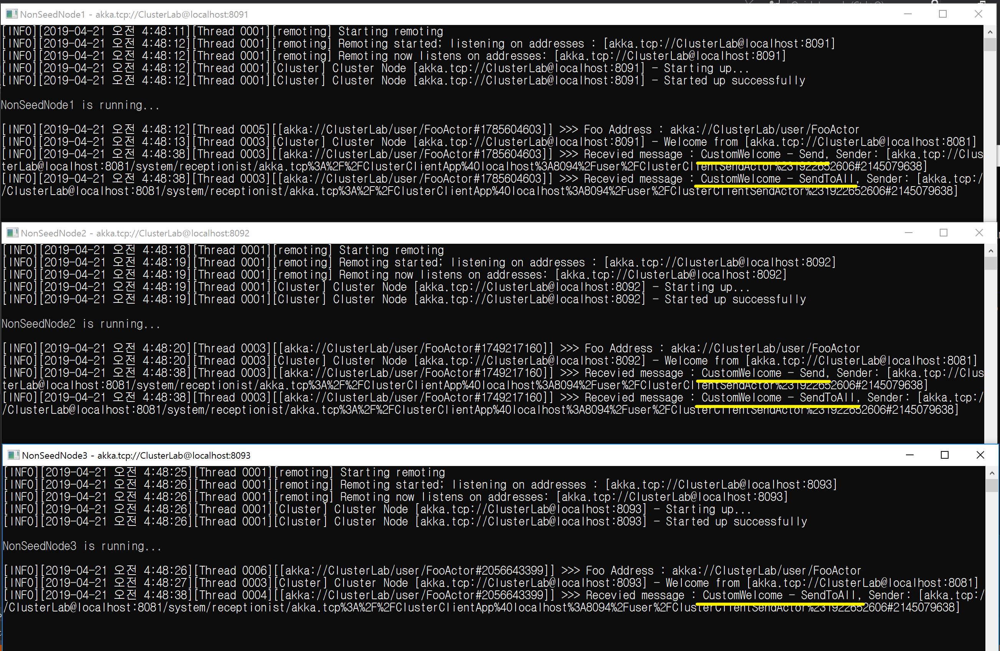

## ClusterClient에서 사용자 정의 메시지 보내기
1. 사용자 정의 메시지는 반드시 Seed Node와 이를 처리할 NonSeedNode 모두에 참조되어야 한다.

## 데모
1. SeedNode1을 실행한다.
1. NonSeedNode1, 2, 3을 실행한다.
1. ClusterClientApp을 실행한다.
   - 사용자 정의를 Send로 2번 보낸다.
   - 사용자 정의를 SendToAll로 1번 보낸다.

   