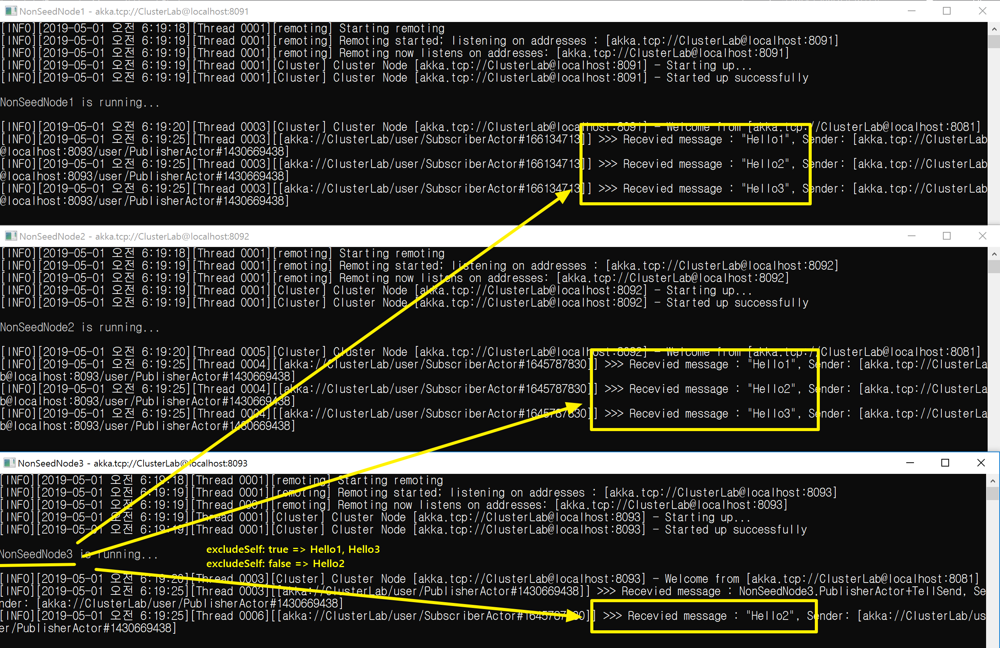

## 자신의 노드를 제외한 액터 경로로 모든 액터에게 메시지 보내기
1. 액터를 등록한다.
   ```
   var mediator = DistributedPubSub.Get(Context.System).Mediator;
   mediator.Tell(new Put(Self)); 
   ```

1. 액터 경로가 같은 모든 액터에게 메시지를 다 보낸다.
   ```
   var mediator = DistributedPubSub.Get(Context.System).Mediator;
   mediator.Tell(new SendToAll("/user/SubscriberActor", 
                "Hello1",
                excludeSelf: true));
   ```

<br/>
<br/>

## 데모
1. 액터 경로(`/user/SubscriberActor`)가 같은 모든 액터에게 메시지를 모든 메시지를 보낸다.
   | excludeSelf: false | excludeSelf: true |
   |---|--|
   | Hello2 | Hello1, Hello3|


